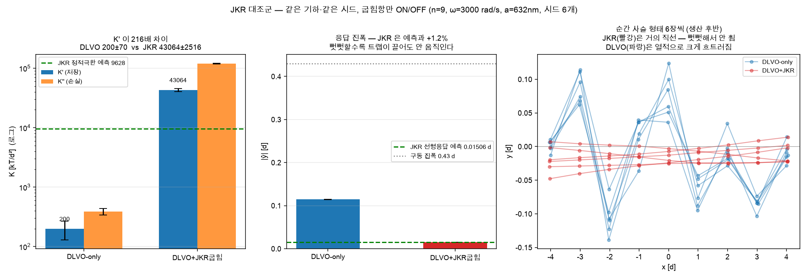
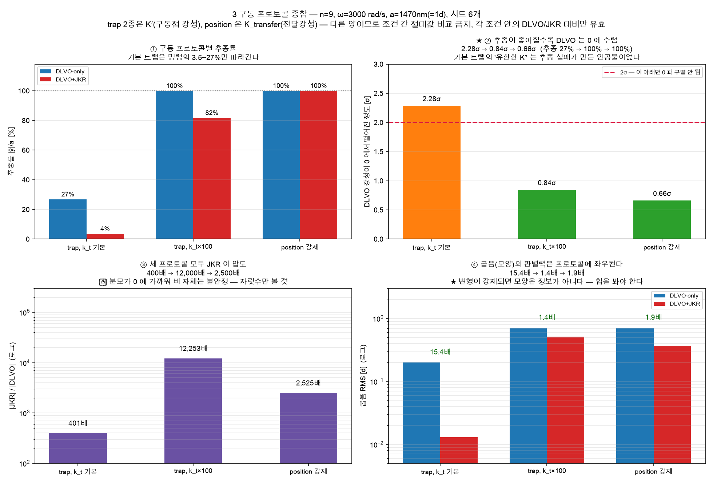
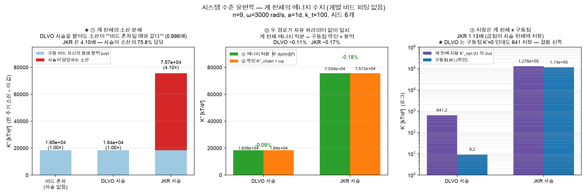
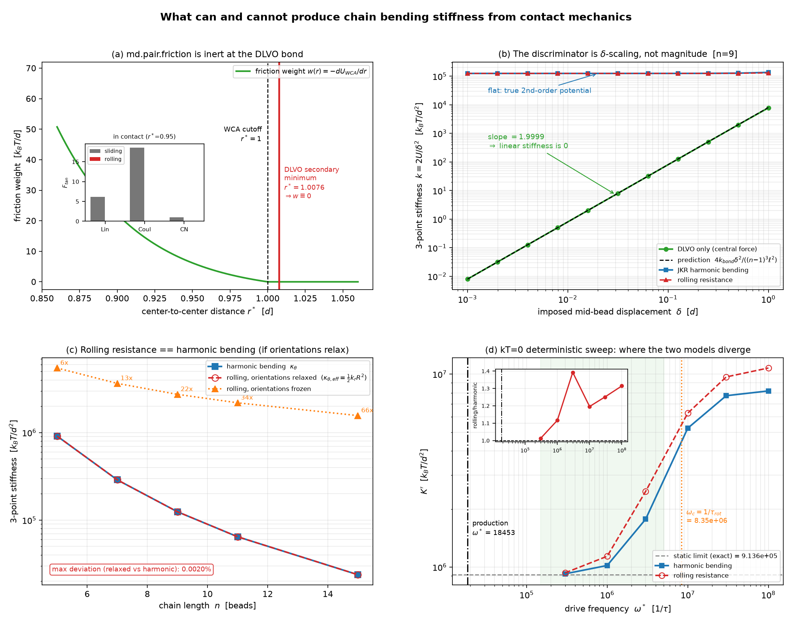
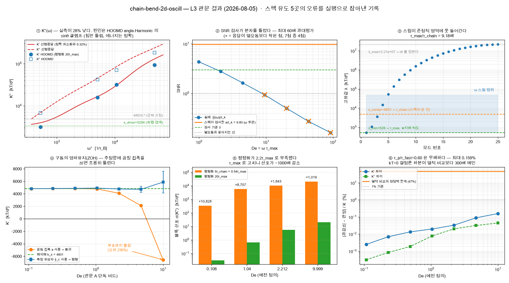
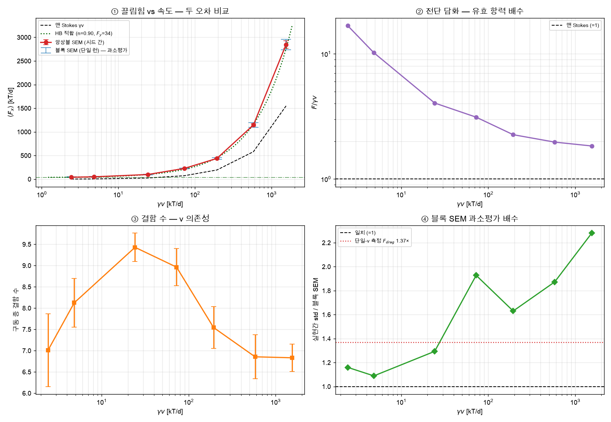
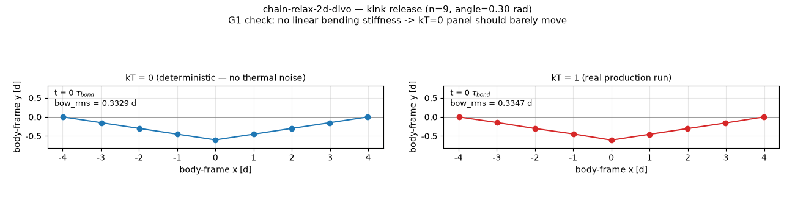
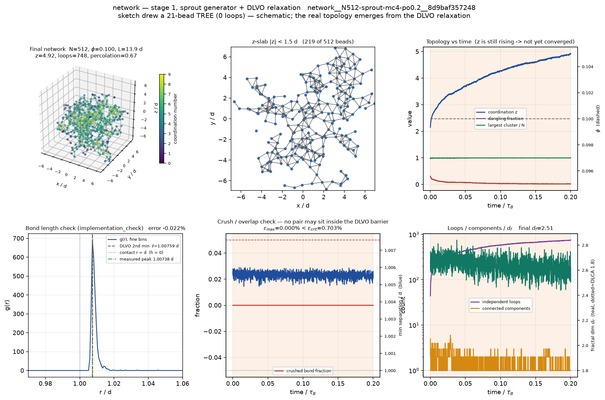
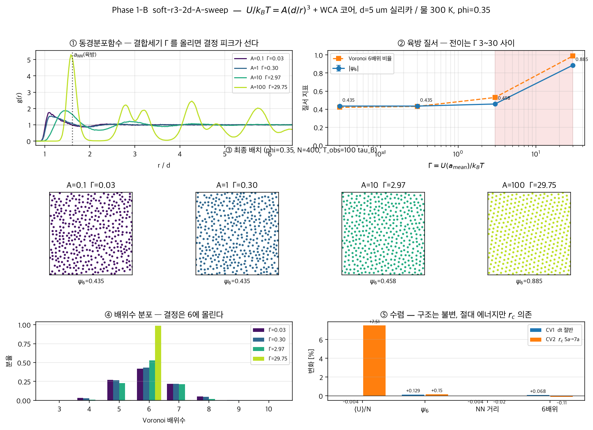

# 04 · Cases — what has actually been run

Eight cases. All eight are `READY` at L0 (intake), L2 (physical system) and L3
(non-dimensionalized). Six have produced runs.

Measured in the merged tree, 2026-08-28:

| Case | Script | Specs | Run dirs | `metrics.json` | `result.txt` |
|---|:---:|---:|---:|---:|---:|
| [`abp-rod-2d-run-flip`](#abp-rod-2d-run-flip) | end-to-end | 3 | 4 | 4 | 4 |
| [`chain-bend-2d-dlvo`](#chain-bend-2d-dlvo--the-central-result) | end-to-end | 162 | 145 | 145 | 145 |
| [`chain-bend-2d-oscill`](#chain-bend-2d-oscill--blocked-by-a-hoomd-bug) | L3 only | 15 | 8 | 7 | 0 |
| [`chain-relax-2d-dlvo`](#chain-relax-2d-dlvo) | end-to-end | 6 | 4 | 4 | 4 |
| [`network`](#network--3d-colloidal-network) | end-to-end | 3 | 4 | 1 | 1 |
| [`soft-r3-2d-A-sweep`](#soft-r3-2d-a-sweep) | end-to-end | 2 | 10 | 9 | 9 |
| [`trap-2d-5um`](#trap-2d-5um) | end-to-end | 3 | 4 | 4 | 4 |
| [`trap-drag-2d-hex300`](#trap-drag-2d-hex300--single-run-error-bars-were-wrong-in-both-directions) | L3 only | 84 | 82 | 80 | 0 |
| | | **278** | **261** | **254** | **167** |

⚠️ **Two of those "0"s are a counting artefact, not missing work.**
`result.txt` is written by the *case script*, not by `bdbot.run`, and the two
L3-only cases never had that line added — so `bdbot.cli status` reports 0 runs
for `chain-bend-2d-oscill` and `trap-drag-2d-hex300` while 87 runs sit on disk
with `metrics.json`. The convention once caused a "clean up incomplete runs"
pass to **delete 6 completed runs**. Filed as a seam in
[00 §5](00-merge-decisions.md#5--known-seams).

⚠️ **Aggregate by tag, not by `run_id`.** `run_id` hashes the physics fields, so
adding a spec field re-ids every run — once, all 137 `chain-bend-2d-dlvo` runs
changed id at the same time.

---

## `chain-bend-2d-dlvo` — the central result

**145 runs · 3 driving protocols · the case this repository exists to have
done.**

The user started this branch by doubting a paper: *"the beam-mechanics reading in
\[P1]\[P2] may be wrong — I want to check it as colloidal bead-spring, not as a
monolithic beam."* Same three-point-bending geometry as
`chain-bend-2d-oscill`, but the bonds are replaced by the **secondary minimum of
a DLVO centre-to-centre pair potential**, and **no angular (bending) potential
is put in at all**. That absence *is* the hypothesis.

★ The hypothesis is **the paper's own argument**. [P1] p.2: *"Such assumptions
have been made based on DLVO interactions between particles, which are
centro-symmetric. If particles did undergo free rotations, we would expect the
aggregates to respond to the bending moment by forming a **trianglelike
structure**"* — the paper found that prediction contradicted by experiment and
so introduced JKR adhesive contact. This case runs the **prediction side**.

**Derived before running (G1).** A straight chain of pure central forces with
every bond at its natural length (`U'(ℓ)=0`) has an `O(y²)` coefficient equal to
`U'(ℓ)`, so the **linear bending stiffness is exactly zero**. The pre-registered
prediction for `K_prime` was therefore fixed at **0** (rule 9.2).

**Result — as derived.**

| Sweep | Cleanest condition | K′ [kT/d²] |
|---|---|---|
| ω, 7 points (10–30000) | ω=10 (quasi-static, 4.6σ) | **41.8 ± 9.0** |
| chain length, 4 points (n=5–25) | n=25 | **12.7 ± 4.0** |
| amplitude, 5 points (a/d 0.07–1) | a=1d | **9.2 ± 2.6** |

Both sweeps decrease monotonically toward 0, and get *closer* to 0 as they get
more precise.

**JKR control — same geometry, same seeds, bending term ON/OFF** (n=9, ω=3000,
a=632 nm, 6 seeds):

| | DLVO-only | DLVO+JKR | ratio |
|---|---|---|---|
| K′ | 199.5 ± 69.9 | 43064 ± 2516 | **216×** |
| bow | 0.1135 ± 0.0048 d | 0.00639 ± 0.00011 d | 17.8× (**22.3σ**) |
| off-diagonal ⟨δyᵢ δyⱼ⟩ | **−0.015** | **+0.905** | — |

**★★ Three protocols — the conclusion does not depend on how you drive it.**
The user pointed out that in the default setting the driven bead only tracks the
trap position to 3.5–29 %, so two more protocols were added:

| Protocol | Tracking | DLVO stiffness from 0 | JKR/DLVO | bow ratio |
|---|---|---|---|---|
| trap, default `k_t` | 27 % | 2.28σ | 401× | 15.4× |
| trap, `k_t`×100 | 100 % | **0.84σ** | 12,253× | 1.4× |
| position-forced | 100 % | **0.66σ** | 2,525× | 1.9× |

**As tracking improves, DLVO converges to zero.** The default trap's apparently
finite `K′ = 105.7` was not elasticity — it was **an artefact of failing to
track**.

⚠️ Note the discriminating power of *bow* collapsing from 15.4× to 1.4×: **when
deformation is imposed, shape carries no information.** The rule is: free
deformation → measure shape; imposed deformation → measure force.

**★★ The system-level statement is the strongest one.** Total dissipation over
one cycle, `K″_total = ∮F·dy/(π|ŷ|²)`: a bare bead with no chain gives
`ωγ = 18453`; **attaching the DLVO chain gives 18380 = 0.996×**; JKR gives
75590 = 4.10× (the chain carries 75.8 %).

⟹ **A DLVO chain is rheologically invisible.** Seen as a whole system, it
dissipates the same as shaking one bead in water. The cross-check has no free
parameters: the energy integral agrees with (lock-in `K″_chain` + ωγ) to
**−0.11 % (DLVO) and −0.17 % (JKR)**.

**Three lessons about observables.**
① **Bow** (max deviation from the chord joining the ends) is the best
discriminant *when the trap is soft* — the finite trap lets the whole chain
translate, and measuring raw `y` lets that rigid-body motion mask the bending
(3.4× in `y` range vs 19.6× in bow). ② The first metric built,
`shape_localization`, had **zero** discriminating power (1.481 vs 1.470 = 0.1σ)
on cases that were obviously different by eye — **a metric must be tested
against both extremes** before it is trusted. ③ Tangent correlation ⟨t·t⟩ is
weak here because both configurations are nearly straight along x.

### Follow-up: friction and tension were both excluded

The user asked two follow-ups — *"is there no way to implement friction
directly?"* and *"wouldn't strong DLVO alone show similar behaviour?"* All three
candidates were answered by execution.

| Candidate | Implementation | Does it create bending stiffness? |
|---|---|---|
| `md.pair.friction` (3 built-ins) | exists, compiled path | ⛔ **cannot** — dissipative + exempt under rolling |
| rolling resistance + tangential spring | new `force.Custom(aniso=True)` | ✅ rolling only. Tangential is **exactly 0** |
| strong DLVO (tension) | existing | △ **only as δ²** — not real bending; 1–5 % of the observed value here |

**① `md.pair.friction` is powerless here** (`verify/verify_pair_friction.py`,
23/23). HOOMD 7.1 does ship `FrictionLJLinear`, `FrictionLJCoulomb` and
`FrictionLJCoulombNewton` (Hofmann et al. 2025, arXiv:2507.16388 — first
executed in this project). Three structural properties, measured: ⓐ the friction
weight is `w(r) = −dU_WCA/dr`, so it is **exactly zero outside the cutoff** —
and the DLVO secondary minimum (`r* = 1.00759`) is outside, giving
`F_tan = |τ| = 0.000e+00` (a control at `r* = 0.95` gives 6.19/18.58/1.00, so
the test has power); ⓑ **dissipative** — zero force at `u=0` however large the
tangential displacement, so it contributes only to `K″` and vanishes in the
quasi-static limit; ⓒ **exempt under no-slip rolling** — all three are exactly
zero when `ω = V/2R`. Three-point bending deforms bonds by **rolling, not
sliding**, so this friction cannot stiffen the chain.

**② Rolling resistance is exactly equivalent to harmonic bending**
(`verify/verify_rolling_contact.py`, 24/24). With body-fixed contact-point
markers, `U_r = k_r R²(2 − (aᵢ−aⱼ)·n̂)` gives, in the orientation-relaxed limit,
**`κ_θ,eff = ½ k_r R²`** — three-point stiffness matches harmonic bending to
within **1e−5** for n=3–15. The origin is **frustration of the interior
particles, which are shared between two bonds** (end particles relax fully).
Conversely a **tangential spring alone gives exactly zero** bending stiffness:
there are more orientation unknowns (n) than bonds (n−1), so a solution zeroing
all of them always exists — confirmed by the residual falling as 1/10⁴ under
δ×100 (1.46 → 1.46e−4), i.e. cancelling round-off, not real stiffness.

**③ Strong DLVO stiffens by tension — but that is not bending**
(`verify/dlvo_tension_stiffening.py`, 4/4). With both ends held, pushing the
centre by δ lengthens the path by `2δ²/L`, so bonds **must** stretch. The
free-parameter-free prediction `K = 4 k_ext δ²/L²` with
`1/k_ext = (n−1)/k_bond + 2/k_t` matches exact minimization to **0.03 %**, with a
log-log slope of **1.9999**. ★ **The discriminant is the δ-scaling, not the
magnitude**: tension gives `K ∝ δ²` (→0 as δ→0), real bending is δ-independent
(1.008/1.004× over a 3000× range in δ). This is not a contradiction of G1 — it
is a **consequence** of it.

⟹ **The 1-D conclusion is strengthened.** Three candidate ways to mimic bending
with central forces only were quantified and excluded, which narrows *why* [P1]
had to introduce JKR: what is needed is neither friction nor tension but
**rolling resistance** — and that is an adhesive contact patch.

---

## `chain-bend-2d-oscill` — the HOOMD bug, and the way around it

The original beam-mechanics case. It is **L3-only** — 15 specs, 8 run
directories, 7 with `metrics.json`, and no end-to-end script registered — and the
reason it stalled is a genuine finding.

**★★ A 28 % discrepancy turned out to be HOOMD, not the theory.**
`md.angle.Harmonic` converts torque to Cartesian force through `1/sin θ` and
**clamps `sin θ` at √2×10⁻³** (measured SMALL = 1.414217e-3, s.d. 1.4e-7). Below
that the force is scaled by `sinθ/SMALL`, making it `∝ κ(θ−π)²` — **quadratic
rather than linear**. Because `t0=π` puts the equilibrium itself at `sinθ=0`, it
bites **hardest on stiff chains**. And **the energy is 0.0000 % correct
throughout**, so no energy check catches it (traps 15·16·17 in skill
`bd-hoomd`).

It was narrowed by ladder: `dt` (exact in the z-region to 0.002 %), then
nonlinearity / x-degrees-of-freedom / bond stretching (an exact scipy
minimization agreed with the linear model to 0.32 %), then energy (0.000 %) —
leaving only the force.

⛔ **All 23 angles of the response profile are inside the broken region**
(min|θ−π| = 7.3e-5, i.e. SMALL/19; even the largest angle is only 2.0× SMALL).
Raising the amplitude to escape is blocked by `δ_max` (M<M_c).

**The route taken was ⓐ: `force.Custom` computing `F = −A y` directly**
(`BENDING_IMPL = "custom_linear"` in [`cases/chain_bend_2d.py`](../cases/chain_bend_2d.py)),
with a ghost particle + `bond.Harmonic(r0=0)` on the compiled path to recover the
26× cost. ★ The hard check was **scoped to the implementation rather than
deleted**: it is `hard=(BENDING_IMPL == "angle_harmonic")`, so `nondim spec`
writes specs today and would refuse again the moment anyone switches back. That
is the pattern to copy — a constraint of an *implementation* should not be
recorded as a constraint of the *system*, and it should not be deleted either.

Two other routes stay open: ⓑ soften κ₀ ⓒ **solve analytically, since this
region is linear** — the exact minimization agrees to 0.32 %, so `G'(ω)` closes
in OU form without MD at all. ⓒ is the cheapest and is on the
[roadmap](06-roadmap.md).

**The L3 gates also caught five derivation errors before any run**
(`verify/verify_chain_bend_gates.py`, `verify/verify_angle_matrix.py`):

| What | Wrong value | Right value |
|---|---|---|
| governing timescale | τ_chain = γ/κ_center | **τ_max = γ/λ_min** (9.18× longer) |
| De | ωτ_chain → "0.1–10" | ωτ_max → **0.99–91.8** |
| equilibration | 20 τ_chain (= 2.2 τ_max) | **20 τ_max** (K* moves 21 %) |
| SNR numerator | drive amplitude `a` | **response `|ŷ(ω)|`** (up to 60× difference) |
| "stiffness the trap feels" | 48EI/L³ (rigidly clamped) | **κ_drive = ×0.682** (both ends are traps) |

Three lessons: ① setting `dt` from λ_max **without looking at λ_min** is the
trap — it comes free from the same eigendecomposition and it is the governing
scale. ② The **SNR numerator is the observable's response, not the drive**.
③ Deliberately putting a stiffness ratio near 1 (κ_end/k_t = 0.463) **guarantees
the boundary-condition assumption breaks.**

★ **Cost was implementation, not physics.** `md.force.Custom` calls into Python
every step and is **26× slower** at n=25 (2,339 vs 61,264 steps/s). Replacing it
with a ghost particle + `bond.Harmonic(r0=0)` — which is exactly `½k r²`, on the
compiled path — gives 55,551 steps/s, turning a 25-day sweep into **1.16 days**.
Measure *which kind* of cost it is before declaring something too expensive.

---

## `trap-drag-2d-hex300` — single-run error bars were wrong in both directions

**Corrected by re-running 7 velocities × 9 seeds = 63 runs** (2026-08-06).
Every error bar is now realization-to-realization spread (ensemble SEM); the old
values used one run's block SEM per velocity.

| Quantity | Old (single run, block SEM) | **New (9 seeds, ensemble SEM)** |
|---|---|---|
| yield force `F(v→0)` | 35–45 kT/d, 11–20σ from 0 | **34–41 kT/d, 9.5–12.6σ** — magnitude holds, significance down |
| shear thinning `F/γv` | 16.9 → 1.87 | **16.8 → 1.84** (9.2×) — reproduced |
| **defect count** | **v-independent** (6.8–9.4) | ⛔ **v-dependent** (max−min = 5.2·SEM) |
| **recovery fraction** | −0.5 → 67 % **monotonic** | ⛔ **non-monotonic**, −13 % → peak 36 % at γv=72.6, then falls |

⛔ **Two conclusions were reversed.** ① Defect count is *not* independent of v —
it **peaks at 9.43 near γv≈24** and falls to 6.8–7.0 at both ends (2.42, 1549):
a **non-monotonic hump**. "No critical velocity" survives; "v-independent" does
not. ② The 67 % recovery was one realization; the ensemble mean peaks at 36 %.
**Both were misread because of a single run plus an underestimated error.**

⚠️ **The block-SEM underestimate factor differs per observable and per
velocity.** The widely-quoted **2.35×** is for `ΔU`/particle; `F_drag` in the
same run was **1.37×**. Across the sweep `F_drag` ranges **1.09–2.28×**
(median 1.63) and **grows with velocity** (1.1 at low v → 2.28 at high v).
In a system that generates stochastic defects, quoting an error without a seed
ensemble is overconfidence.

✅ **The observable definitions did not change in the L5 migration** (verified
2026-08-06 on the v=0.5 group, 8 seeds,
`verify/verify_trap_drag_generations.py`): **55 `result` scalars + 19 npz arrays
are bit-identical** (relative difference <1e-12) and the step count matches
(2,330,846). The spec hash differed only because
`system.external.drag_velocity` went from a single 0.5 to a 7-point list —
`params` and `numerics` differ by **zero**. Wall-clock improved 1.65× (all 8
runs 1.64–1.68×). ⚠️ Other velocities cannot be compared this way because the
legacy runs were overwritten — the apparent 6× speed-up at v=1.5 is
**unverified**.

**The yield force is an extrapolation, so it depends on the functional form.**
Three answers are reported rather than one: ⓐ lowest-velocity measurement
`40.7 ± 3.2` (12.6σ, no extrapolation — most defensible) ⓑ log-linear
**diverges** as `v→0` and cannot define a yield force ⓒ Herschel–Bulkley
`F_y = 34.2 ± 3.6` (9.5σ, n=0.90, χ²/dof=2.97).

**L3 also caught, before running, that this case has no statistics**: all seven
hard checks pass, but SNR = 0.0985, so a single traverse gives 5.5 % precision
on `⟨F_drag⟩` against a 2 % target, and the lattice period recurs only 17 times.

---

## `chain-relax-2d-dlvo`

The static, undriven partner of `chain-bend-2d-dlvo` — the **rule 8 static stage
that `chain-bend-2d-dlvo` skipped**. Traps, ghost particles and driving all
removed: DLVO table potential (imported unchanged from
`chain_bend_dlvo_2d.py`) + WCA core + Brownian, nothing else.

Because there is no trap, the chain rotates and translates freely, so shape
descriptors **must** be computed in the chain's **own body frame** (axis through
the two ends). `chain-bend-2d-dlvo`'s `_bow(y)` used lab coordinates because the
trap fixed the orientation; that does not transfer.

★★ **The golden test missed the harmonic approximation by 4.6× — and it was the
well's asymmetry, not a bug.** Bond-stretch equipartition was naively predicted
as `kT/k_bond`, and the smoke run disagreed at 6.67σ. The DLVO secondary minimum
is **asymmetric** — steep on the barrier side, much softer on the outside where
`h→∞, U→0⁻` — so the harmonic approximation *underestimates* the true variance.
Boltzmann-integrating the whole basin inside the barrier gives **4.57× the
harmonic value**, and that is the real prediction. With the prediction corrected,
the error converged 6.67σ → 2.15σ as sampling grew (smoke 50 → full run 20,000
τ_bond): **no porting bug, just insufficient statistics**
(`bond_variance_boltzmann()`). Same trap family as soft-r3's "Einstein cage
approximation breaks under anharmonicity."

Pilot (n=9, 1 seed, 2 M steps, **1.8 s wall** — very cheap, because with no trap
and no driving the only candidate stiffness is bond stretch): bond-stretch
variance matches the corrected prediction (−13.7 %, 2.15σ). Bending-angle thermal
fluctuation is ⟨dθ²⟩ = 0.127 rad² (σ≈20°/bond) — a `measurement`, with no prior
prediction, since G1 says nothing about magnitude.

The kink-release experiment (0.3 rad, 300 k steps) reduced `bow_rms` from 0.334 d
to 0.313 d over 3000 τ_bond — **only 6 %**. That is a qualitative signal of
diffusive loss rather than elastic recovery (collapse to 0), but it is
**a single seed and therefore not decisive**.

**Next step (awaiting confirmation):** ensemble over multiple seeds to fix the
`bow(t)` relaxation curve statistically, and if needed a larger kink angle to
raise the signal.

---

## `network` — 3D colloidal network

**In progress.** Stage 1 (gelation) under way; stage 2 (driving, `G′(ω)`) not
started.

The sketch ([`intake/network/`](../intake/network/)) **contains no numbers at
all** — only symbols (A, ω) and model names (DLVO, JKR) — so
`missing_required` is unusually long. That is the correct output, not a failure.
Material properties are all inherited from `chain-bend-2d-dlvo`.

It follows **rule 8's two-stage structure** exactly:

- **Stage 1 (now)** — building the network. Scatter → aggregate into the DLVO
  secondary minimum → compress → φ=0.10 → relax, then measure **structure**
  (z · independent loops · free ends · d_f · percolation · g(r) · fraction of
  collapsed bonds).
- **Stage 2 (not started)** — force one particle as `x(t)=A sin(ωt)` and sweep
  the **driving direction**. Driving, stress propagation and `G′(ω)` live here.

There is a second reason for the split beyond rule 8: **HOOMD's bonds and angles
are static topology and cannot be declared mid-aggregation.** The contact list
has to be extracted and the topology frozen after gelation before stage 2 exists
(which is also why JKR bending is stage 2).

**The one completed run is a `sprout` topology generator, not compression**
(N=512, max_coord=4, 20.85 M steps, 1757 s): z=4.92 · 748 independent loops ·
2.34 % free ends · d_f=2.51 · zero collapsed bonds. L4 is OK, but ⟨U⟩/N drifts by
6.9 block-SEM over the relaxation window, so **equilibration is insufficient**.

⚠️ This topology was **imposed**, not produced by DLVO dynamics, so it has to be
contrasted against the compression route before topology-dependence is visible
(rule 7′) — and those 2 compression runs are the ones left incomplete (they kept
only `traj_A.gsd`).

★ **The compression constraint was measured before running**
(`verify/verify_3d_boxresize.py`): `update.BoxResize` affinely scales
coordinates (error 8.9e-16), which shortens **already-bonded** pairs too. Past
0.703 % linear strain per trigger, a pair is pushed inside the barrier and
**collapses irreversibly into the primary minimum** (0.40 % holds / 0.80 %
collapses). Hence 0.4 % per step over 178 steps.

---

## `soft-r3-2d-A-sweep`

2D soft-repulsive `A/r³`. The most statistically developed case across the three
generations — `Simulation_bot` alone ran **3,856 production runs** on it and
built 31 benchmarks.

Verification: perfect-lattice `ψ₆=1`, liquid exponent `p=1/2`, hexagonal NN
distance, energy consistency. It has no analytic solution, so it carries
**post-hoc guards** (`post_checks` — `r_tab_min`/`min_sep` margins).

★ The L5 migration re-run at full size (A=100, N=400, 3.3 M steps) reproduced
the old run **bit-for-bit**: energy consistency 105.510722899358, hexagonal NN
distance 1.6170154574513436, ψ₆ 0.8854118251800537 — identical to 15 decimal
places.

⚠️ `bdbot.run.execute()`'s `checks` schema still has only two phases
("design"/"post_run"), so the post-hoc guards `finalize()` produces are stored
under `metrics["result"]["post_checks"]` rather than top-level `checks[]`. If a
third case needs this pattern, it gets promoted properly.

The `Simulation_bot` campaign on this system is in
[`campaigns/`](../campaigns/) — `soft2d_ascan`, `soft2d_fss`, `soft2d_hexwin`,
`soft2d_nconv`, `soft2d_relax_seeds`, `soft2d_time_series`. Its own history
contains two corrections worth reading: a truncation error **biased an exponent
by 2.9σ**, and a run labelled "hexatic" turned out to be a crystal — the ψ₆
finite-size exponent rejected the reading, not the eye.

---

## `trap-2d-5um`

The first end-to-end case, and still the golden test for trap implementation:
`⟨x²⟩ = kT/k` (static equipartition) **before** the PSD (dynamic).

From one hand sketch (2D optical trap, `R=5 µm`, `k=10 pN/µm`, `T=300 K`) the
settled answers were `⟨x²⟩ = 416.58 ± 1.85 nm²`, `τ_trap = 8.0567 ± 0.0300 ms`,
`f_c = 19.7 Hz`, with best precision `τ_fit/τ = 0.9998 ± 0.0008` (**0.08 %**) and
MSD `R² = 0.99998`. Total compute: **10.6 s** for 16 runs. Four errors were
caught in the process, one of them an S7 **false rejection** by a KS test on
correlated samples.

★ The L5 migration replaced its own `HarmonicTrap` class with
`bdbot.traps.make_trap` and re-ran: 5 observables matched the old runs
(`a49f2508556b`, `d724e8d507cc`) to display precision — same seed, same physics,
so the trajectory reproduces exactly.

Two bugs were caught during that migration (both filed as `tooling` KB entries):
① `MET.build(extra=...)` merges via `m.update(extra)`, so `finalize()`'s `result`
lands at **top-level** `metrics["result"]`, not `metrics["extra"]["result"]` —
otherwise it is silently `nan`. ② If `sample()` returns the full N-particle array
on every sample, `observables.npz` balloons 448 KB → **148 MB (330×)** — derived
quantities must accumulate in a closure and only the needed subset stored raw.

---

## `abp-rod-2d-run-flip`

Active Brownian rods. Kept as a **negative example of case design**: five
predictions, **all `implementation_check`, zero hypotheses** — so it validated
the implementation and discovered nothing. That is what [02
§4](02-verification.md#4--the-role-of-a-prediction-decides-what-a-mismatch-means)
is about.

This system has neither pair interactions nor traps (the active force is
non-conservative), so there is no potential energy for `pe_per_particle` to point
at. Instead it uses the equilibrium indicator the original implementation already
had — `⟨cos Δθ⟩`, the orientation correlation against the previous call: healthy
means every call sees a new noise realization so it can never be exactly
constant, and if rotational diffusion dies it pins to exactly 1.0 and FROZEN
fires.

⛔ **Anisotropic translational friction was concluded to be impossible in BD** —
there is no hydrodynamic interaction, so only the isotropic mean γ̄ is available,
and the anisotropy **cannot be faked with a general formula either** (rule 9).

Two new traps came out of this case (skill `bd-hoomd` 19·20): `pair.friction`'s
lever arm is `particles.diameter/2` and is **independent of `sigma`**; and
`Brownian`'s `velocity` is not 0 but **uncorrelated thermal noise**.

---

## What the literature added

Two books were distilled (2026-08-06): 24 KB `handbook` entries, 56/56 checks
passing in [`verify/verify_book_claims.py`](../verify/verify_book_claims.py).

**★ The `chain-bend-2d-dlvo` conclusion was promoted by [L] Leal §2.2**, which
proves that in creeping flow the hydrodynamic stress is **exactly zero the
instant the flow stops**, so **all viscoelasticity comes from the thermodynamic
component**. "A degree of freedom with no restoring mechanism does not contribute
to stress" is therefore **a general structure of all complex fluids** — our G1
was a derivation for our system, and it turns out to be an instance of a general
theorem. The 0.996× dissipation ratio is not a coincidence.

**★ "You cannot extract `G′` from a single chain" is also a theorem.** Bulk
stress is by definition ⓐ a volume average over statistically many particles and
ⓑ, in Batchelor's formula, conditional on the particles being **force- and
torque-free**. A trap is an external force (breaking ⓑ); one chain breaks ⓐ.
**Our `K′·K″` are stiffnesses, not stresses, and renaming them `G` would make
them wrong.** A real `G′(ω)` needs periodic boundaries + a chain *network* + no
traps + imposed shear + the Kramers stress `T^(p) = n⟨F_s R⟩ − nkT I`.
⚠️ Omitting `−nkT I` leaves a non-zero equilibrium stress that reads as **fake
elasticity** — being zero at equilibrium is the golden test.

**★ Three convention traps, all execution-verified.** ① The numerator of Pe/Wi is
`|E| = √(2E:E)`, **not** `|∇u|` — vorticity cannot change an isotropic
equilibrium. Using `√(E:E)` is off by **√2**, and pure rotational flow has
`|∇u|≠0` but **Pe=0**. ② In SAOS the **normal stress difference oscillates at
`2ω`**, so our `ω`-only lock-in **cannot see it in principle**; and `η′=G″/ω`,
`η″=G′/ω` cross over. ③ Dilute axisymmetric orientation relaxation is
**`1/(6D_r)`** — but **the 6 is the 3D `l=2` coefficient**, and pasting it onto
`abp-rod`'s 2D `⟨cos Δθ⟩` is wrong.

**★ Our `η = 0.851 mPa·s @ 300 K` survives, but `T=300 K` is the weak point.**
Log-linear interpolation of [W] Appendix I gives 0.8580 mPa·s → **+1.03 %**
(linear interpolation gives +2.91 % — **the interpolation method changes the
answer**). But water's viscosity is **2.06 %/K** sensitive, and `T=300 K` was
inherited from `trap-2d-5um`, whose sketch had no temperature — **it is recorded
as tier 1 but it is a choice, not a measurement.** At 298 K, η is off by −4 %; at
293 K, −14 %, with τ_B following. Qualitative conclusions are unaffected;
quantitative comparison to literature must expose this.

⚠️ [L] covers **neither microrheology/GSER** (zero full-text hits) **nor active
matter**, so `abp-rod` is outside its frame and it **neither supports nor
contradicts** our GSER conclusion.

**★ Two new case candidates** — ① **`D_r` suppression in semi-dilute rods**,
`D_r = β·D_r,dilute/(nL³)²`, β=1.3e3. The suppression is an **excluded-volume
(steric) effect, not HI**, and in the slender limit HI does not modify Jeffery
rotation → **a rare case where HI-free BD is the right tool**, with a
one-free-parameter quantitative prediction. It would be the **first rod case with
a genuine `hypothesis`**. ② **Flow distortion of the hard-sphere pair
distribution** — a **sign** prediction (`g` high in the compressional quadrant,
low in the extensional; Batchelor 1977), directly measurable in 2D BD.

**★ Boundary numbers.** Dilute↔semi-dilute is `nL³=O(1)` in theory but **10–50
in experiment, 30 by convention** → when it goes into a check it must be a
**warning (⚠), not a hard failure (❌)**. A dilute sphere suspension is
**exactly** Newtonian, and the `φ²` term reaches 10 % of the Einstein term at
**φ≈4 %**.
